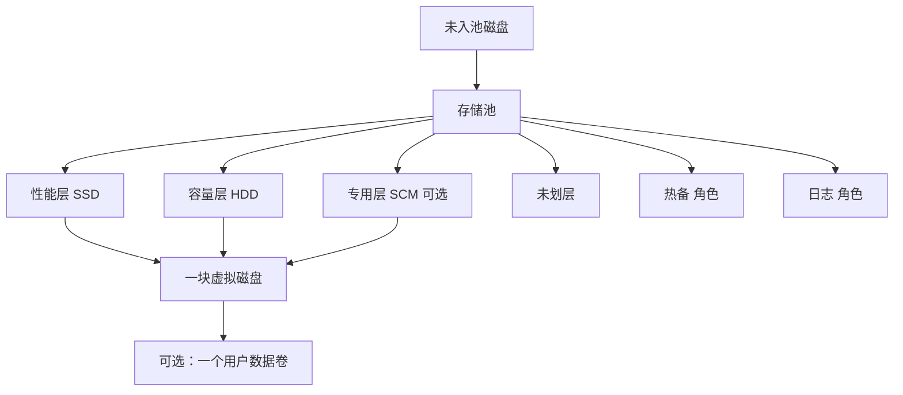

# WinPool 单机存储池编辑方案（已认可产品设计）

[English](Storage-Pool-Editor-Design.md) | [简体中文（仅供阅读）](Storage-Pool-Editor-Design.zh-CN.md)

> 本文件仅为中文阅读副本；产品设计以无 `.zh-CN` 后缀的
> [Storage-Pool-Editor-Design.md](Storage-Pool-Editor-Design.md) 为准。

| 项 | 内容 |
| --- | --- |
| 状态 | 开发者已认可；冻结于本归档。活动实施计划见 `docs/Plan.md` |
| 日期 | 2026-09-07 |
| 范围 | 1.x 单机完整编辑：工作站 + 独立服务器。补齐图形界面没有、PowerShell 有的能力 |
| 不做 | 集群 / Storage Spaces Direct / Windows Admin Center / 故障域跨节点；创建第二块虚拟磁盘 |
| 卷 | 存储结构编辑：一块虚拟磁盘 + 一个用户数据分区。多分区去「磁盘分区编辑」 |

已确认边界：

1. 现在只考虑单机，包含工作站和独立服务器的完整功能；补完 UI 没有但 PowerShell 提供了的功能；不考虑集群 / S2D / WAC。
2. 工作站 + 独立服务器单机池为一等对象。
3. 池结构 + 虚拟磁盘上的卷。创建或修改只支持单磁盘单分区；多分区去另外页面。页面要有勾选框「创建磁盘时自动创建分区」，默认勾选；可以不在此处创建分区。
4. 已认可的产品设计冻结于本归档；活动实施计划见 `docs/Plan.md`。
5. 研究结论写成默认可改：预填 `64K + 64K`、SSD Mirror / HDD Parity；`256K` 要警告。

本轮增补：

1. 取消当前「编辑」页。下区改为新页 **存储结构编辑**，上区改为新页 **磁盘分区编辑**。
2. 磁盘分区编辑：控件区拆成磁盘一组、分区一组。
3. 存储结构编辑：左侧拓扑；右上存储结构操作；右下池 / 虚拟磁盘 / 分区属性。
4. 1.0 不允许创建第二块虚拟磁盘。已有多块的池允许改到只剩一块。额外操作若需要，走开发页命令行，不在 1.0 范围。
5. 虚拟磁盘卷支持 NTFS 和 ReFS。
6. 拓扑不画空层。添加层是右上结构操作；有成员后才出现该层横条。
7. 应用预览用人话步骤清单，1.0 结构页不展开原始命令。

---

## 1. 要解决什么

微软把同一套存储池拆成三层残缺界面，完整能力只在 PowerShell：

| 界面 | 能做什么 | 故意或实际藏掉的 |
| --- | --- | --- |
| Windows 11 设置 → 存储空间 | 建池、建空间、Simple / 双向镜像 / 三向镜像 / 奇偶 / 双奇偶、优化、换盘 | 分层、交错区、列数、精简/固定、回写缓存、介质类型、热备/日志、逻辑扇区 |
| 控制面板「存储空间」 | 同上，外加改名、准备删除 | 同上 |
| Server Manager「文件和存储服务 → 存储池」 | 精简/固定、分层勾选、热备 Allocation、修复、作业 | 交错区、列数、每层不同复原、回写缓存大小；向导默认列数经常是错的 |
| PowerShell `Storage` 模块 | 完整 | 默认 Interleave **256K**、NTFS 默认 **4K**；模板层和虚拟磁盘层是两套对象；文档缺参数 |

研究结论（当前测试建议，Win11 尚未同等测试）：

```text
64K interleave + 64K NTFS cluster = current tested recommendation.
```

- `64K + 64K`：当前测试稳定
- `64K + 256K`：两阶段 NTFS 损坏
- `256K + 64K`：发生过失败，目前不推荐
- `256K + 256K`：直接 NTFS 损坏，Event 55

产品要做的是：**把单机 Storage Spaces 的完整对象一次摆清楚，用一份可预览的草稿完成创建和修改，而不是再做第四个残缺向导。**

---

## 2. 目标与非目标

### 目标

- 单机工作站与独立服务器，同一套编辑模型。
- 用户能看见并设置 PowerShell 能设置、微软 GUI 不能设置的参数（回写缓存除外：见 §8.1，1.0 只作高级项、跟 Windows 默认）。
- 分层是一等能力，不是高级彩蛋。
- 创建路径默认产出：一池 + 按介质划分的层 + **一块**虚拟磁盘 +（默认）一个用户数据卷。
- 推荐参数预填，可改；危险组合警告，不静默采用微软默认。
- 操作可预览、可审计；仿真默认；真实变更要当场授权。
- 结构与参数同属一份草稿，一次应用。
- 现有「编辑」页取消，拆成存储结构编辑与磁盘分区编辑。

### 非目标

- 集群、S2D、CSV、嵌套复原、WAC 仪表板。
- 在存储结构编辑里做完整磁盘管理（未入池磁盘的多分区、动态磁盘、存储副本）。
- **创建第二块虚拟磁盘。** 这是产品设计，不是暂时没做。1.0 不考虑。若有人需要，走开发页命令行。
- 把研究结论写成不可改的强制配置。
- 再做一个「简化模式」把交错区/列数藏回去。
- 1.0 存储结构页展示原始 PowerShell 命令。

---

## 3. 用户概念模型

不要让用户先学模板层、再学虚拟磁盘层、再手动删模板。那是 PowerShell 仪式，不是产品概念。

用户只面对这一条链：

```text
可用磁盘（primordial / 未入池）
        ↓ 入池，并带角色
存储池
        ↓ 按介质划层（可没有层 = 未划层）
层：性能 / 容量 / 专用(SCM) / 未划层 / 热备 / 日志
        ↓ 从层里切容量
一块虚拟磁盘
        ↓ 可选
一个 GPT 用户数据卷（外加静默 MSR）
```



### 对象词典

| 用户用语 | 含义 | 不要叫成 |
| --- | --- | --- |
| 存储池 | 物理磁盘的资源集合 | RAID 卡、阵列 |
| 层 | 池内按介质和复原划分的数据落点 | 缓存盘（层不是普通写缓存，也不是回写缓存） |
| 未划层 | 已是池成员，但没有划进任何数据层 | 未连接、未分配（后者像分区空隙） |
| 热备 | 磁盘角色 Usage=HotSpare，不参与当前条带 | 未划层 |
| 日志 | 磁盘角色 Usage=Journal，给回写缓存用 | 性能层 |
| 虚拟磁盘 / 存储空间 | 从池切出的一块盘，操作系统把它当磁盘 | 卷、分区 |
| 用户数据卷 | 这块虚拟磁盘上唯一的数据分区 + 文件系统 | 第二块虚拟磁盘 |
| 交错区 Interleave | 一次条带里写到**单块物理盘**的连续字节 | 完整条带宽 |
| 列数 Columns | 一条完整条带跨过的磁盘数；镜像时不等于盘数 | 「用了几块盘」 |
| 复原 | Simple / Mirror / Parity | RAID 0/1/5 的精确等同（只作对照） |
| 回写缓存 WriteCacheSize | 虚拟磁盘上的一块 Storage Spaces 写回缓存（常落在 SSD/日志盘） | 研究文里的软件/硬件磁盘缓存 |

模板层（Size=0、挂在池上）和虚拟磁盘层（有 Size、挂在虚拟磁盘上）在产品里合成一件事：**层的规格属于池；层的用量属于这块虚拟磁盘。** 用户改规格是在改层；用户改用量是在改这块盘从该层拿走多少。不要逼用户先建空模板、再切盘、再删模板。

---

## 4. 编辑哲学

1. **先看见结构，再改参数。** 拓扑是主表面。
2. **一份草稿，一次应用。** 拖盘、改层、改名、改交错区、勾选是否建分区，都进入同一份「目标状态」。点应用之前，已提交系统不变。
3. **推荐是默认，不是锁。** 打开草稿就按研究结论预填；用户改了就用用户的。256K 相关组合必须警告。
4. **有数据时拆开「可改」和「要重建」。** 拒绝时说明对象和原因，不要把表单悄悄打回旧值。
5. **一块虚拟磁盘是产品契约，不是现阶段省略。** 创建只产一块。已有多块时允许删到一块。
6. **拓扑不画空层。** 没有成员的层不占横条。加层用右上结构操作；盘划进去之后才出现该层。

---

## 5. 页面信息架构

取消当前「编辑」页，拆成两个新页。原来的上下两半不再挤在同一页。

```text
导航：…  管理  存储结构编辑  磁盘分区编辑  监控  设置  …
```

### 5.1 存储结构编辑（原编辑下区）

```text
┌──────────────────────────────────────────────────────────────┐
│ 系统：本机 / 仿真文档     模式：仿真 | 真实（需授权）           │
├────────────────────────────┬─────────────────────────────────┤
│                            │ 右上：存储结构操作                │
│ 左：拓扑结构区             │  新建池 / 解散池 / 应用草稿      │
│  池                        │  添加层 / 删除层                  │
│   ├ 虚拟磁盘（目标：一块） │  加入磁盘 / 逐出 / 退役 / 热备   │
│   ├ 性能层 · 有成员才画    │  收成一块虚拟磁盘（已有多块时）  │
│   ├ 容量层 · 有成员才画    │  优化 / 修复                      │
│   ├ 未划层 · 盘…           ├─────────────────────────────────┤
│   └ 热备 / 日志            │ 右下：属性                       │
│                            │  池 / 虚拟磁盘 / 分区             │
│                            │  （随左侧选中切换）               │
├────────────────────────────┴─────────────────────────────────┤
│ 草稿条：N 项变更   预览计划   放弃草稿   应用                    │
└──────────────────────────────────────────────────────────────┘
```

- **左：拓扑。** 只画有成员的数据层。未划层在有未划入层的池成员时显示。热备、日志按角色成组。
- **右上：结构操作。** 改成员关系、层的有无、虚拟磁盘的有无（最多一块）、解散、优化、修复。不在这里填交错区。
- **右下：属性。** 池名、层规格、虚拟磁盘用量、置备、是否自动建分区、文件系统（NTFS / ReFS）、簇大小、盘符、卷标。选中左侧对象时切换。
- 多用户分区的虚拟磁盘：右下分区属性只读，入口去磁盘分区编辑。
- 已有多块虚拟磁盘：拓扑都画出来；右上提供「收到一块」（删除多余虚拟磁盘，有数据要确认）。没有「再切一块」。

### 5.2 磁盘分区编辑（原编辑上区）

未入池磁盘、以及虚拟磁盘上多于一个用户分区时，在这里改。

```text
┌──────────────────────────────────────────────────────────────┐
│ 左：磁盘 → 分区 / 未分配 拓扑                                  │
├────────────────────────────┬─────────────────────────────────┤
│ 右上：磁盘操作             │ 右下：分区操作                    │
│  联机 / 脱机               │  新建 / 删除 / 扩展 / 压缩        │
│  初始化 GPT/MBR            │  格式化（NTFS / ReFS）            │
│  转换分区表                │  改盘符 / 卷标                    │
└────────────────────────────┴─────────────────────────────────┘
```

控件区明确拆成两组：一组只对选中的**磁盘**生效，一组只对选中的**分区或未分配空隙**生效。不要混成一列「有时亮有时灰」的长按钮。

### 5.3 草稿条（两页各自一份，互不冲）

- 结构页的草稿管池/层/虚拟磁盘/其单卷。
- 分区页的草稿管未入池磁盘和多分区。
- 应用才写入仿真文档或（已授权时）真实系统。
- 预览：人话步骤 + 容量 + 警告。不展开原始命令。

---

## 6. 创建：一条组合，不是两个向导

创建在存储结构编辑页的空白池草稿上一次填完。

### 6.1 选盘

- 列出可池化磁盘：容量、总线、固件报的介质、健康、分区占用。
- **介质类型必须可改。** USB/SAS/部分 NVMe 常报 Unspecified，不改正就无法分层。
- 系统盘、启动盘默认排除且不可勾选。
- 带用户数据的盘要二次确认：入池会清除该盘现有分区结构。

### 6.2 角色

每块入池盘一个角色，对应 `Usage`：

| 角色 | 默认 | 说明 |
| --- | --- | --- |
| 数据（自动） | 是 | 参与层 |
| 数据（手动） | | 在池里但不自动进新虚拟磁盘，需用户划层 |
| 热备 | | 重建用，不进当前条带 |
| 日志 | | 给回写缓存；池里需要 SSD/SCM 当日志时才有意义 |
| 退役 | 修改时才出现 | 准备移除 |

### 6.3 层

有 SSD 就在右下预填性能层规格；有 HDD 就预填容量层；有 SCM 就预填专用层。用户可用右上「添加层 / 删除层」。

**拓扑规则：没有成员的层不画。** 预填规格可以已经存在于右下，但左侧要等至少一块盘划入才出现该层横条。盘在未划层时，左侧只看到未划层。

每层规格预填：

| 层 | 复原默认 | 其它默认 |
| --- | --- | --- |
| SSD 性能 | 2 块及以上：Mirror，2 副本；1 块：Simple | 列数交给 Windows（镜像不手填）；Interleave **64K** |
| HDD 容量 | Parity，冗余 1 | 等容量：列数 = 盘数；混容量：列数 = 盘数 − 1；Interleave **64K** |
| SCM 专用 | 与 SSD 相同规则 | Interleave **64K** |

用户可改为 Simple / Mirror（2 或 3 副本）/ Parity（冗余 1 或 2）。右下即时显示最少盘数、可用容量、完整条带大小（`Interleave × Columns`）。

**列数、交错区是一等参数。** 选项至少 16K / 32K / 64K / 128K / 256K。默认 64K。选 256K 时硬警告。

### 6.4 一块虚拟磁盘

- 名称默认跟池名，可改。
- 每一层一个用量：默认「该层可用最大值（略留余量）」，可改小。
- 置备：有任意层时强制 **Fixed**。无层才允许 Thin / Fixed，默认 Fixed。
- 逻辑扇区：池级默认 **4K**，可改 512。创建后不可改。
- **不允许再切第二块。** 右上没有该按钮。

### 6.5 分区勾选

控件文案：**创建磁盘时自动创建分区**

- 默认：**勾选**
- 可取消：只建虚拟磁盘，不在本页建分区

勾选时只做：

1. GPT 初始化
2. 静默 MSR（不算用户分区，拓扑上不画成第二分区）
3. **一个** 用户主分区，用满剩余
4. 格式化

| 项 | 默认 | 可改 |
| --- | --- | --- |
| 文件系统 | NTFS | **NTFS 与 ReFS 都支持**；SKU 不允许创建 ReFS 时该项禁用并说明 |
| 簇大小 | **64K**（NTFS 研究默认） | 4K / 8K / 16K / 32K / 64K；ReFS 按该 SKU 允许的簇大小列出 |
| 盘符 | 下一个空闲 | 可空（不指派） |
| 卷标 | 与虚拟磁盘名相同 | 可改 |

研究目前不推荐把 ReFS 当测试过的默认；产品仍必须能选 ReFS。默认预填 NTFS，选 ReFS 时提示：当前分层长测建议针对 NTFS 64K，ReFS 没有同等证据。

取消勾选：应用后是一块 RAW 虚拟磁盘，去磁盘分区编辑再切。

已有多于一个用户分区：右下只读，「在磁盘分区编辑修改」。

### 6.6 预览后应用

预览必须同时有：

- 目标拓扑
- 原始容量 / 复原后可用 / 各层用量
- 警告（256K、单 SSD 性能层无冗余、Thin 超配、将清除入池盘数据、删除多余虚拟磁盘）
- **人话步骤清单**（建池、设介质、建层、建虚拟磁盘、初始化、建分区、格式化…）

1.0 不在本页展开「等价 PowerShell」。命令行属于开发页，且不在 1.0 范围。

---

## 7. 修改

### 7.1 成员与层

| 用户动作 | 含义 |
| --- | --- |
| 未入池 → 池 | 加入池，默认数据角色，按介质进对应层；没有该层则进未划层，可用右上「添加层」 |
| 层 A → 层 B | 只允许同介质；跨介质要先改介质类型 |
| 层 → 未划层 | 逐出：留在池内，退出条带。该层若因此没有成员，**横条消失**，规格仍留在右下，除非用户删除层 |
| 未划层 → 层 | 划入；没有该层横条时，先添加层或从右下启用该层规格 |
| 改为热备 / 日志 | 改角色；从数据层出来 |
| 拖出池 | 退回未入池；有虚拟磁盘数据时按微软规则：先退役、重建、再删除 |
| 退役 | Usage=Retired，准备换盘 |

### 7.2 有数据时的锁

「有存储数据」= 卷上有文件系统且已用空间 > 0（空文件系统不算死锁）。

| 仍允许 | 拒绝（要重建才行） |
| --- | --- |
| 改池名、虚拟磁盘名、卷标、盘符 | 交错区、列数、复原类型、副本/校验数 |
| 加入新盘、优化池 | 置备类型、逻辑扇区 |
| 修复虚拟磁盘 | 把簇大小/文件系统改成另一种（等于格式化） |
| 逐出到未划层（确认后） | 删层但该层仍被虚拟磁盘使用 |
| 扩大层用量 / 扩大卷（操作系统允许时） | 缩小到小于已用 |
| 删除**没有数据**的多余虚拟磁盘，收到一块 | 在仍有数据的第二块盘上「强行合并」而不说明会删数据 |

### 7.3 未划层池如何加层（拓扑不画空层）

池已在、盘全在未划层、左侧没有性能/容量横条：

1. 右上「添加层」，或右下启用预填的性能/容量规格
2. 把未划层的盘划进该层 → 左侧才出现该层
3. 若还没有虚拟磁盘：右上创建这一块
4. 一次应用

不要靠「画出一个空的性能层卡片」当入口。

### 7.4 已有多块虚拟磁盘

- 1.0 **不能**再创建一块。
- 允许「收到一块」：删除多余虚拟磁盘，使池只剩一块。无数据可直接进草稿；有数据必须确认删除该空间上的卷。
- 不能把两块盘的数据自动合并成一块。
- 其它花式切分只允许开发页命令行，1.0 不做。

### 7.5 维护操作

- 优化池、修复虚拟磁盘、优化卷（分层热度迁移是耗时作业，要能看见）
- 存储作业进度与健康状态

---

## 8. 推荐默认与危险组合

打开新建草稿时预填，可改。

| 参数 | 预填 | 说明 |
| --- | --- | --- |
| SSD 复原 | Mirror ×2，仅 1 块则 Simple | 单 SSD 要提示无冗余 |
| HDD 复原 | Parity，冗余 1 | 双奇偶是显式选项，不是默认 |
| HDD 列数 | 等容量 = n；混容量 = n−1 | 不要用 Windows 自动的 3 |
| Interleave | 64K | 系统默认 256K 不当推荐 |
| 置备 | 分层则 Fixed | 无层才允许 Thin |
| 逻辑扇区 | 4K | 可 512 |
| 文件系统 | NTFS | ReFS 可选，同等支持 |
| 簇大小 | 64K | 系统默认 4K 不当推荐 |
| 自动建分区 | 勾选 | |
| 回写缓存 | Windows Auto | **不是研究结论**，见 §8.1 |

警告，不是禁止：

- Interleave 或簇大小任一侧为 256K
- 性能层只有一块 SSD 还选了 Mirror
- Thin 且分层（应直接拦）
- 奇偶列数小于盘数太多
- 三向镜像磁盘数不够（不含热备至少 5 块）

诚实句保留：Windows 11 尚未做与 Win10 22H2 同等的完整测试。ReFS 没有与 NTFS 64K 同等的长测证据。

### 8.1 回写缓存是什么，研究文有没有

这是两件不同的事。

**Storage Spaces 回写缓存（`WriteCacheSize`）**  
建虚拟磁盘时，Storage Spaces 可以在池里划出一小块（通常落在 SSD 或 Usage=Journal 的盘上），先接写入再刷到镜像/奇偶条带。设置和控制面板几乎不暴露大小；Server Manager 也基本没有；PowerShell 的 `New-VirtualDisk -WriteCacheSize` / `-AutoWriteCacheSize` 才有。有分层时微软还要求 Fixed 置备。它**不是**性能层本身：性能层是按热度放热数据的 SSD 层；回写缓存是虚拟磁盘前的一小块写缓冲。

**V10 研究文里的「缓存」不是这个。**  
英文稿「Cache control」、中文稿「缓存对照」写的是：企业级 HDD 随机写很高，于是对照「全缓存 / 关软件缓存 / 再关硬件写缓存」。那是操作系统磁盘缓存和硬盘固件写缓存，用来解释随机写数字，不是 `New-VirtualDisk -WriteCacheSize`。逐步教程里的 `New-VirtualDisk` 也没有设 WriteCacheSize。

因此 1.0：

- 不当成研究预填（不再写「有性能层则默认 0」）。
- 右下属性里可作为高级项，默认跟随 Windows Auto。
- 不在主路径强调，避免和性能层、磁盘缓存三个「缓存」混名。

---

## 9. 能力对照

| 能力 | 设置 | 控制面板 | Server Manager | PowerShell | 存储结构编辑 |
| --- | --- | --- | --- | --- | --- |
| 建池 / 删池 | 有 | 有 | 有 | 有 | 有 |
| 建空间（虚拟磁盘） | 有，参数少 | 有，参数少 | 有，中等 | 完整 | **只允许一块** |
| 分层 | 无 | 无 | 勾选，不能每层不同复原 | 有 | **一等** |
| Interleave | 无 | 无 | 无 | 有 | **一等** |
| NumberOfColumns | 无 | 无 | 无（向导瞎选） | 有 | **一等** |
| 每层不同复原 | 无 | 无 | 无 | 有 | **一等** |
| Thin / Fixed | 无 | 无 | 有 | 有 | 有 |
| WriteCacheSize | 无 | 无 | 无 | 有 | 高级项，默认 Auto |
| 逻辑扇区 4K/512 | 无 | 无 | 弱 | 有 | 有 |
| 改介质类型 | 无 | 无 | 弱 | 有 | **入池前必做** |
| 热备 / 日志 / 退役 | 无 | 无 | 热备有 | 有 | 有 |
| 未划层成员 | 看不清 | 看不清 | 弱 | 成员列表 | **一等层** |
| 逐出但仍留在池 | 无 | 准备删除整盘 | 退役 | Remove from tier / Usage | 有 |
| 修复 / 优化 / 作业 | 优化池 | 有一点 | 有 | 有 | 有 |
| 单卷 NTFS / ReFS | 有，簇大小不对 | 有 | 新卷向导 | 有 | **两者都支持**，默认 NTFS 64K |
| 多分区 | 设置里磁盘与卷 | 磁盘管理 | 磁盘管理 | 有 | 磁盘分区编辑 |
| 第二块虚拟磁盘 | 有 | 有 | 有 | 有 | **1.0 不做创建**；已有多块可收到一块 |
| 集群 / S2D | 无 | 无 | 有限 | 有 | **不做** |

---

## 10. 工作站和独立服务器：同一编辑器，能力探测

| 差异 | 产品行为 |
| --- | --- |
| 工作站设置页极简 | 存储结构编辑仍给完整参数 |
| ReFS 创建权限随 SKU 变 | 不允许创建就禁用并说明，不从产品里拿掉 ReFS |
| 独立服务器可能有 SAS 机箱 | 有 Enclosure 才给「机箱感知」；不是 S2D 故障域 |
| 双奇偶、三向镜像磁盘下限 | 同一约束表，不够就禁用并写原因 |
| 本机真实变更 | 当场授权；UAC 不等于授权 |

---

## 11. 两页交接

| 情况 | 去哪 |
| --- | --- |
| 未入池磁盘的分区、格式化、联机/脱机 | 磁盘分区编辑 |
| 虚拟磁盘上已有 **多于一个用户分区** | 存储结构编辑右下只读 → 磁盘分区编辑 |
| 池内已有 **多于一块虚拟磁盘** | 结构页可「收到一块」；不能再切一块 |
| 取消「自动创建分区」之后 | 磁盘分区编辑去初始化 |
| 自由命令、第二块虚拟磁盘等 1.0 不做的事 | 开发页命令行（1.x 开发页仍是占位，不在 1.0 交付） |

「用户分区」不含 GPT MSR、EFI。MSR 在自动建分区时静默创建。

---

## 12. 安全与模式

- 仿真是默认路径。
- 真实结构变更：V0.5 起才允许类型化路径；每次点名操作和目标；授权不预勾、不持久化。
- 计划用人话写清将删除哪些数据、是否重建、是否格式化。
- 1.0 存储结构页和磁盘分区页都不提供自由文本 PowerShell。
- 硬件序列号等进持久化/导出要走脱敏。

---

## 13. 关键决策

1. 取消「编辑」页：下区 → 存储结构编辑，上区 → 磁盘分区编辑。
2. 存储结构编辑：左拓扑，右上结构操作，右下池/虚拟磁盘/分区属性。
3. 磁盘分区编辑：磁盘控件一组，分区控件一组。
4. 一份草稿一次应用。
5. 拓扑不画空层；加层用右上操作。
6. 藏起模板层仪式：规格在池，用量在虚拟磁盘。
7. **一块虚拟磁盘是 1.0 产品契约。** 不创建第二块。已有多块允许收到一块。其余走开发页命令行，不在 1.0。
8. 单用户分区；自动建分区默认开；多分区去磁盘分区编辑。
9. 虚拟磁盘卷 **NTFS 和 ReFS 都支持**；默认 NTFS 64K。
10. `64K + 64K` 等研究结论是预填，可改；256K 警告。
11. 列数、交错区、介质类型、磁盘角色上一等表面。
12. 回写缓存与研究文「缓存对照」不是一事；1.0 作高级项，默认 Windows Auto。
13. 应用预览只用人话步骤，不展开原始命令。
14. 机箱感知仅在探测到机箱时出现。
15. 本文冻结于 `docs/Archive/V0.47-standalone-pool-editor/`。

---

## 14. 已拍板（本轮）

| 原问题 | 决定 |
| --- | --- |
| 第二块虚拟磁盘 | 不做创建。已有多块可改到一块。其它需求开发页命令行，1.0 不考虑。 |
| 回写缓存 | 研究文没有 `WriteCacheSize`。文中缓存是磁盘软/硬件写缓存。本方案改为高级项、默认 Auto，不按研究预填 0。 |
| 空层 | 拓扑不显示没有成员的层。加层是结构操作，不是画一张空卡片。 |
| 文件系统 | NTFS 与 ReFS 都要支持。 |
| 「等价命令摘要」 | 指应用前预览里是否列出只读 PowerShell。1.0 **不展开**。预览用人话步骤。 |

暂无新的待拍板项。若「收到一块」在有数据时只允许删多余盘、不允许合并数据，与上文一致；若你要另一种收法，再说。
