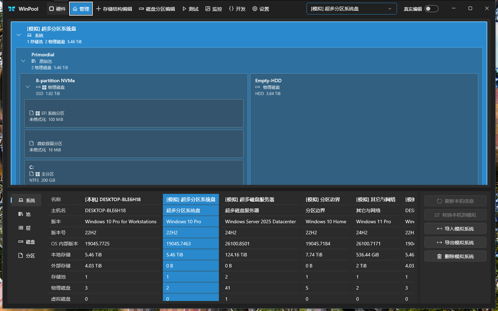
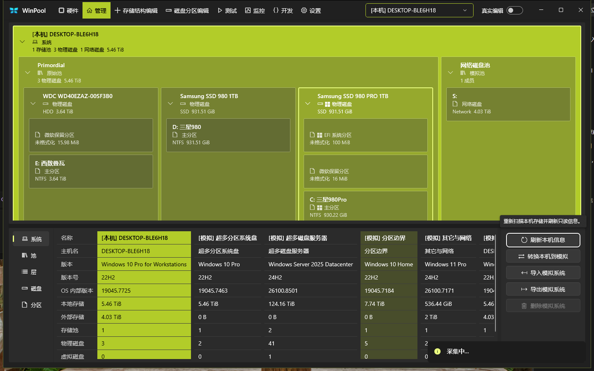
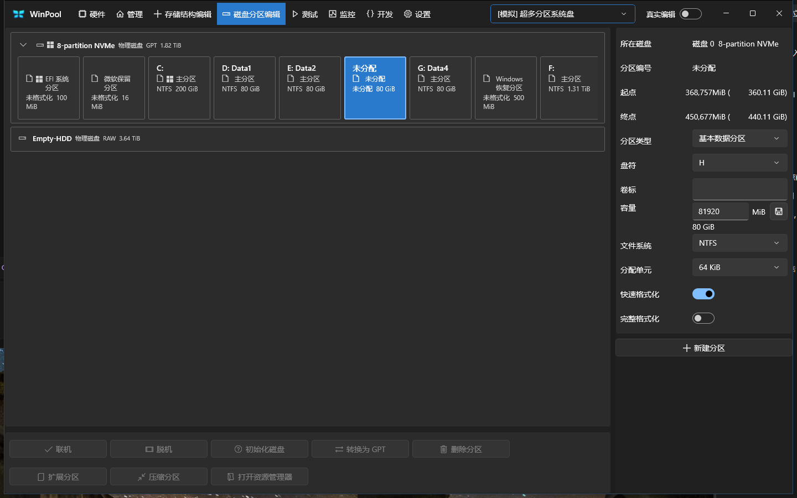
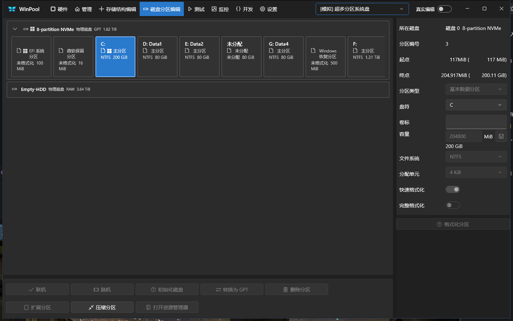
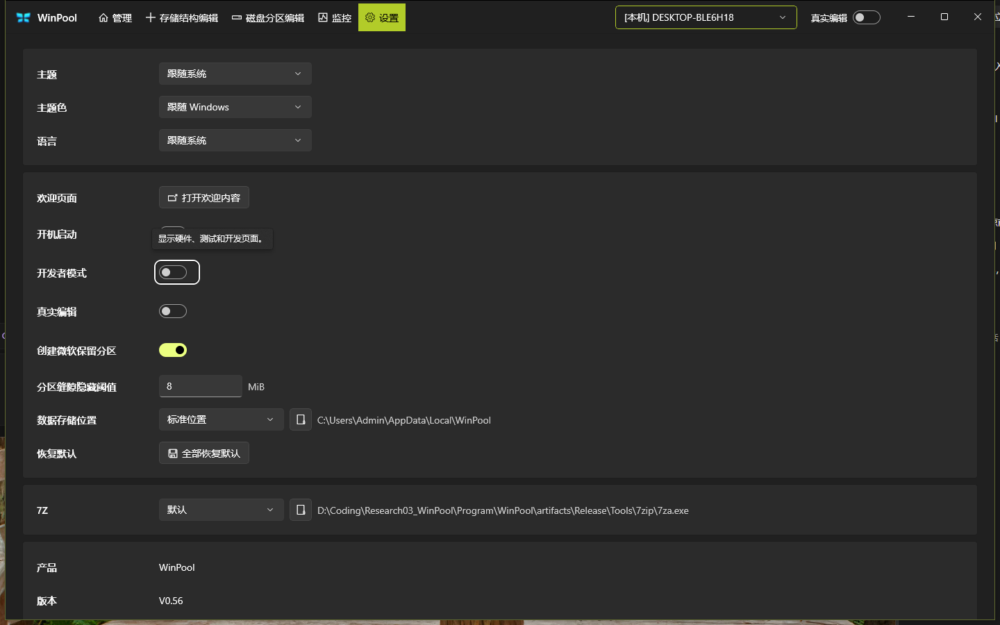
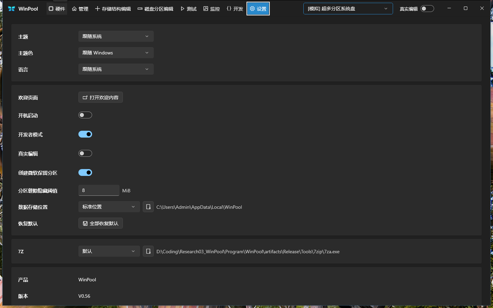
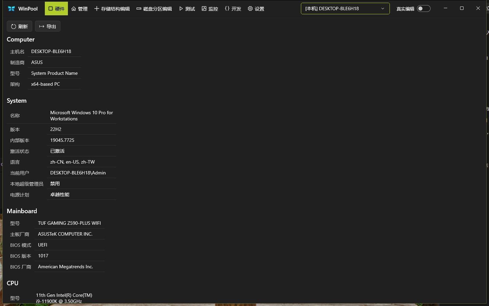
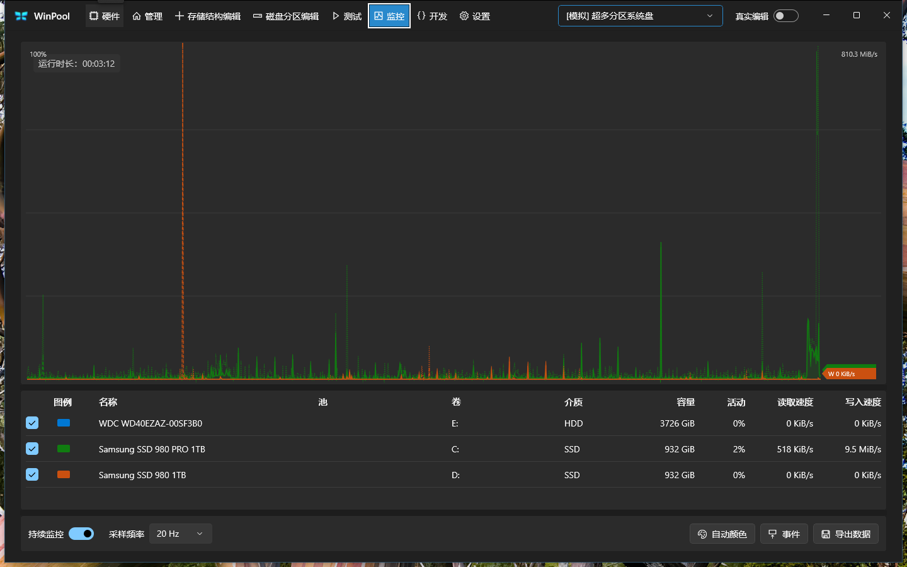
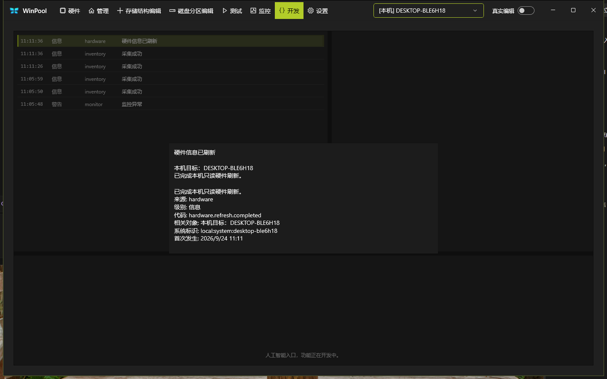
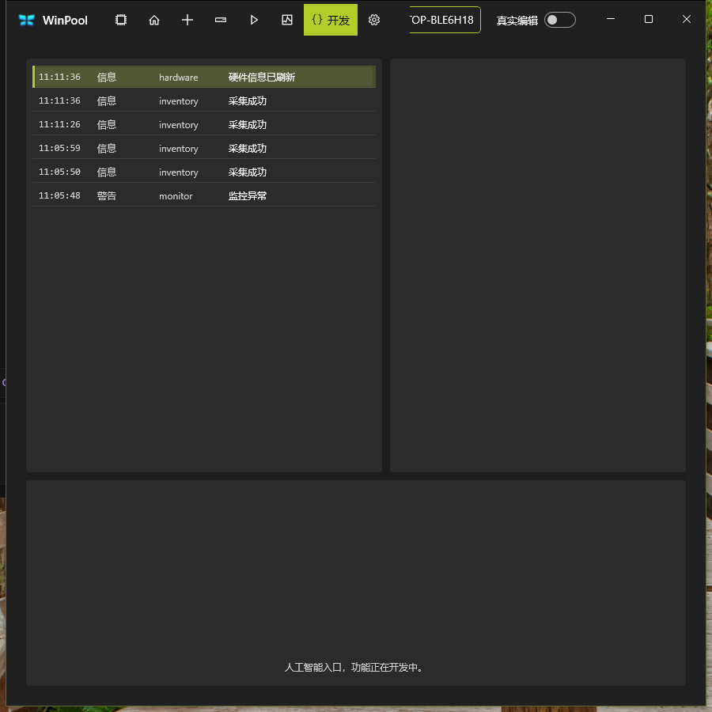

# WinPool V0.56 独立审查报告

- **审查方**：Grok（独立审查官，非实现代理）
- **对象**：`Program/WinPool`，GitHub <https://github.com/GitRuozhi/WinPool>
- **基线**：本地与 `origin/main` 同为 `58723748ad3591ec12c9b16dc142142e1330376b`（`Bump WinPool version to V0.56`），工作树审查开始时干净
- **产品版本源**：`Directory.Build.props` → **V0.56**（0.5 迭代 6）
- **日期**：2026-09-24
- **证据**：同目录 [`Grok-Independent-Review-20260924-evidence/`](Grok-Independent-Review-20260924-evidence/)
- **本轮未做**：真实存储结构修改、模拟提交（新建/格式化/应用）、管理员 UAC 全流程、完整 DPI/高对比度矩阵

---

## 1. 总体结论

V0.56 作为 **本机只读采集 + 受控模拟编辑工作台** 已经能在本机标准 Release 树上启动、导航、采集、监控和按规则拒绝危险分区动作。进程模型、类型化 IPC、Agent 单 SQLite 写入方、以及 Execution 对真实结构突变的硬拒绝，在源码和自动测试里是落实的。

同一版本 **还不是** 可以按 GitHub About / 欢迎窗文案理解的「磁盘管理与存储空间替代品」。壳层已经摆出「真实编辑」开关和完整管理导航，真实写路径仍未接通；公开 Latest Release 停在 V0.51；欢迎窗写「开源免费」，根 README 写保留所有权利。质量门方面，Architecture 测试在本轮实测 **41 通过 / 6 失败**，不能再引用 2026-09-23 的 47/47 作为当前树证明。

**审查判定**：预 1.0 研究型桌面工具，工程边界清楚，产品对外叙事与质量门落后于代码。进入本机真实编辑（`docs/Plan.md` 已定边界、尚未实施）之前，应先收口公开文案、架构门、Agent 生命周期和「真实编辑」开关语义。

| 面 | 判定 | 一句话 |
| --- | --- | --- |
| 真实存储安全 | 当前路径关闭 | 执行器硬拒绝，生产未注册，采集只读 |
| 可运行性 | 通过 | 标准 Release 0 警告 0 错误，主窗 1440×900 可操作 |
| 架构与质量门 | 未通过当前树 | Architecture 6 失败，字符串快照滞后 |
| 产品设计 | 预 1.0 自洽，1.0 壳层超前 | 模拟编辑语法完整，真实模式是空开关 |
| 公开 GitHub | 错位 | Latest=V0.51，About/topics/欢迎窗过满 |
| 依赖漏洞 | 本轮源上未发现 | `dotnet list package --vulnerable --include-transitive` 各项目无已知漏洞包 |

---

## 2. 范围、方法与限制

五个并行审查包加主审查官复核：

1. 静态架构与代码质量（只读源码）
2. 安全、IPC、存储突变路径（只读源码；未跑 GUI）
3. 产品设计（README / Product / 设计表 / XAML）
4. 测试体系、文档一致性、GitHub 公开面（`gh` + `git ls-files`）
5. 真实软件测试：重建 `artifacts/Release`，用 native-winui-control（UIA + `CopyFromScreen`）驱动 WinUI 3 主窗

主审查官独立复核了版本源、Execution 拒绝器、Architecture 失败断言、欢迎窗文案、GitHub 元数据，并亲自运行：

```text
dotnet build WinPool.slnx -c Release --no-restore -m:1     # 由 UI 审查子代理执行，0 警告 0 错误
dotnet test tests/WinPool.Architecture.Tests ...          # 41 passed / 6 failed
dotnet test tests/WinPool.Execution.Tests ...             # 42 passed / 0 failed
dotnet list WinPool.slnx package --vulnerable --include-transitive
```

TRX 在本地 `artifacts/test-results/grok-independent-review-20260924/`（该目录按 `.gitignore` 不入库）。

截图为窗口区域实拍，文件均远大于历史黑帧（约 4 KB）；欢迎窗约 300 KB，管理页约 150 KB。

---

## 3. 产品与版本身份

设置页关于栏实测 **WinPool / V0.56**。根 README 中英对、Product、Development、CHANGELOG 均写 V0.56，并声明真实存储结构修改尚未开放。CHANGELOG 对升版提交本身也写明：构建通过，**未跑自动测试或原生验收**。本轮补上了这两项中的一部分。

GitHub 仓库公开、无 SPDX 许可证（`licenseInfo: null`），与 README「自有代码保留所有权利」一致。7-Zip Extra 许可证在 `assets/ThirdParty/7zip/26.03/`。Latest Release 仍是 **V0.51**（2026-09-11，`WinPool-V0.51-win-x64.zip`）。无 `.github/workflows`，Issues 为空。

---

## 4. 静态审查

### 4.1 架构

两进程边界是真实结构，不是文档口号。

- Domain 无项目引用；Execution → Domain；Application → Domain + Execution；Agent 持有 SQLite 写租约后才打开写仓储；App 启动历史走 `SqliteOpenMode.ReadOnly`。
- 模拟提交：规则与草稿在 App/Application；Agent 做 SHA-256、修订、CommitId、事务。`SkippedForSimulation` 出现在模拟计划参数里。
- 假池/假层不能作为模拟修改目标（`SimulationEditCoordinator.ResolveTarget`）。
- IPC 11 / 核心 schema 17 / 监控 schema 1 / 文档格式 3 在协议常量与文档之间一致。

结构张力：

- Application 同时承载事实模型、规则、通知契约；`StorageEditRules`、`EditWorkspace` 体积大，但是规则没有泄漏成页面私有公式。
- Execution 对模拟路径主要是计划哈希、一次性授权和 executor gate；真实安全边界是「本地突变执行器未接线」。
- 上帝类（约行数）：`StorageStructurePage.xaml.cs` 3828、`EditWorkspace.cs` 2243、`WorkspaceViewModel.cs` 2123、`DiskPartitionPage.xaml.cs` 2064、`MainWindow.xaml.cs` 1798。
- App 与 `Infrastructure.Windows` **未** `TreatWarningsAsErrors`，与 Domain/Execution/Sqlite 等层不一致。
- 架构测试白名单不覆盖 App / Agent / 两个 Infrastructure 项目。

### 4.2 本轮实测的 Architecture 门

`WinPool.Architecture.Tests`：**47 项中 41 通过、6 失败、0 跳过**。失败全部是源码字符串快照与 HEAD 脱节，不是运行时崩溃。

| 用例 | 断言 | 当前树 |
| --- | --- | --- |
| `ProductFacingVersionUsesTheRepositoryVersionSource` | `<WinPoolVersionIteration>5` | 迭代 **6** |
| `TitleBarProvidesStorageSystemSelector` | `Width="320"` | 选择器 **260 DIP** |
| `EditorPagesOwnTheirSurfacesWithoutSectionTitles` | `StackPanel MinWidth="412"` | 已改为 `MinWidth="0"` |
| `DevelopmentPageRemainsGatedAndShowsOnlyInMemoryMessages` | 详情直接子节点 `TextBox` | 现为不透明 `Border` 包 TextBox |
| `MonitorPageBackgroundModeHasStableKeyboardAccessKey` | `MonitorPage.xaml.cs` 含 `SetRateAsync` | 已迁到 `MonitoringService` / `MonitorAlertObserver` |
| `NotificationShellKeepsThreeSimpleCardsAndDeveloperOnlyDetails` | `MonitorPage` 含 `UpdateIssueStates(` | 同样已迁出页面 |

这些失败证明：Architecture 套件把布局数字、迭代号、XAML 子节点形状冻成回归，合法 UI 迭代会红，漏改测试会让 Quality 里的「47/47」变成过期截图。**V0.56 不能引用 2026-09-23 的 Architecture 全绿。**

### 4.3 失败分类被压扁

Agent `CommitSimulationEditAsync` 把参数错误、JSON、冲突、`SqliteException` 一律映射为 `Rejected` + `agent.persistence.simulation_edit_rejected`。客户端对非 `OutcomeUnknown` 抛 `InvalidOperationException`，结构页再收成「文档未改」。Development 要求的成功 / 明确失败 / 结果未知 / 修订冲突，在这条链上没有分开。传输未知路径的 CommitId 对账是完整的。

`ExecutePlanAsync`（整批应用）没有 `ExecuteAsync` 那种 `OperationCanceledException` → `Cancelled` 分支。手动采集失败把 `ex.Message` 送进管理页状态行。

---

## 5. 安全与存储安全

### 5.1 真实存储写路径（代码 + 测试）

**当前产品不能通过类型化计划改写 Windows 存储结构。**

1. `LocalStorageMutationExecutor` 在授权通过后仍返回 `executor.local-storage-mutation-unavailable`（`OperationExecution.cs`）。生产 Agent **未注册**该执行器；它只出现在 Execution 测试里。
2. `OperationPolicyEvaluator` 把保护机上的 R4 拒绝放在风险/能力/提权之前；R5 直接 `policy.r5-not-implemented`。Real 模式、管理员、伪造计划元数据不能把保护机突变做成可批准计划。
3. 模拟提交固定 `EnvironmentKind.Simulation` + `SimulateStorageMutation`。分区页格式化文案与执行器一致：不格式化真实磁盘。
4. Agent 控制面是封闭判别器，没有任意命令消息。测试用 `{"executable":"powershell.exe"}` 作为未知类型被拒绝。
5. 采集脚本 GZip+Base64 内嵌，经 stdin 调系统 `powershell.exe`，不落地 `.ps1`。`ReadOnlyStorageCommandPolicy` 拒绝 `New/Set/Remove/Clear/Initialize/Format/...` 存储 cmdlet。原生 CIM 为固定 SELECT；物理盘 `CreateFile` 访问掩码为 0（查询/IOCTL）。
6. 解释性 PowerShell 预览标明占位 CIM 对象永不绑定执行。

本轮 **Execution 测试 42/42 通过**，覆盖保护机拒绝与「合法 Gate 之后执行器仍拒绝」。

界面上的 Real 开关、UAC、`--winpool-elevated-real` **不能**接通写盘。`docs/Plan.md` 状态为「实施尚未开始」。

用户主动打开的 `diskmgmt.msc` / `dfrgui.exe` / 资源管理器 / 设备属性，是 Windows 自带 UI，需要用户在那些窗口里再操作。提权后这些窗口也是提权的。这不是 WinPool 类型化写路径。

### 5.2 进程、IPC、数据

- Agent 管道：当前用户 ACL、禁止继承、`FirstPipeInstance`、IPC 11 握手、校验同目录 `WinPool.App.exe`。代码中无 impersonation。
- 提权交接会等旧中等完整性 Agent 退出。新的提升 Agent 仍接受同路径、低完整性的 `WinPool.App.exe`（中等风险：可改 7Z 路径、请求 CSV 写出、关机）。
- 自定义 7-Zip：只检查绝对路径存在，Agent 按固定 7z 参数拉起该文件，无 Authenticode。产品文档承认不预检。
- 监控 CSV：协议层可由已握手 App 指定任意 `.csv` 路径（建目录、可覆盖）。
- 激活管道弱于控制管道（可预测名、默认 ACL），可把窗口拉到前台；`SelectShellPage` 仍用 DeveloperMode 挡住隐藏页。
- 导入 JSON 强制变成新 ID 的模拟系统，schema 3 + SHA-256；不能写成 Local 库存。先按 64 MiB 在 App 内解析，再受 3 MiB IPC 限制。
- 硬件序列号、主机名、磁盘型号进入 UI / SQLite / 导出，是已记录的产品选择。

`dotnet list package --vulnerable --include-transitive`：当前 nuget.org 源下各项目 **没有已知漏洞包**。仓库 Dependabot / vulnerability alerts 关闭，GitHub 不强制该门。

---

## 6. 真实软件测试

标准运行树 `artifacts/Release`，命令 `dotnet build WinPool.slnx -c Release --no-restore -m:1`：**0 警告、0 错误**，合并 288 shared / 294 App-only / 10 Agent-only / 0 collisions。启动 `WinPool.App.exe`，主窗类 `WinUIDesktopWin32WindowClass`，标题 `WinPool`，物理 1440×900。配套 Agent 同目录。欢迎窗会抢走 `Process.MainWindowTitle`，启动成功以 HWND + UIA 名称为准。

驱动方式：native-winui-control（UIA 模式 + 真实鼠标点击拓扑节点 + `CopyFromScreen`）。未提交模拟应用，未改数据根。

### 6.1 场景结果

| 场景 | 结果 | 证据 |
| --- | --- | --- |
| 启动主窗 + 欢迎窗 | passed | `01-startup-welcome.png`、`01-startup.png` |
| Agent 随 App 启动 | passed | session-log，PID 8788 / 42768 |
| 恢复上次系统（模拟超多分区） | passed | 启动管理页选择器 |
| 开发者门：关则隐藏硬件/测试/开发 | passed | `17-developer-mode-off.png`、`18-developer-mode-on.png` |
| 管理拓扑 + 分类表 | passed | `02-manage.png` |
| 本机只读刷新「采集中…」→「采集成功」 | passed | `10-manage-refresh-notification.png` |
| 硬件十段标题存在 | passed | Computer…Network UIA；`03c-hardware-local.png` |
| 模拟系统下硬件刷新禁用；本机可刷新 | passed | `11-hardware-refresh-disabled-hover.png`、`03c-hardware-local.png` |
| 结构编辑右栏约 320 DIP、待应用区、未点应用 | passed | `04-storage-structure.png`，分隔条 8 px，右栏约 328 px |
| 空隙 →「新建分区」Enabled | passed | `12-disk-partition-gap.png`，HelpText 含 1 MiB 对齐 |
| C: →「格式化分区」Disabled | passed | `13-disk-partition-existing.png`，HelpText 系统/启动保护 |
| 监控运行时长与 20 Hz | passed | `07-monitor.png` |
| 设置：V0.56、数据路径、7Z | passed | `09-settings.png` |
| 开发页无大标题；双击详情；点外关闭 | passed | `14-development-detail.png`、`14b-development-detail-closed.png` |
| 900×900 窄窗再恢复 | passed | `15-narrow-window.png`、`16-window-restored.png` |
| App Close 后 Agent 随退 | **failed** | session-log 11:14:00 之后需手动停 Agent |

### 6.2 关键画面

欢迎窗（文案问题见第 8 节）：


管理页（模拟系统拓扑 + 多系统对照表 + 标题栏「真实编辑」开关）：



本机刷新通知卡：



分区页：选未分配空隙，主按钮为可点的「新建分区」：



选 C: 后主按钮改为禁用的「格式化分区」：



开发者模式关闭后导航只剩五项：



设置页版本 V0.56：



本机硬件报告（字段保持原值）：



监控页：



开发页消息详情（正文重复一句）：



900×900：中文导航收成图标，系统选择器被裁成 `OP-BLE6H18`：



### 6.3 实测缺陷

1. **App 点标题栏 Close 后 Agent 仍在。** 本轮残留约 15–25 s 后仍需 `Stop-Process`。产品约定「配套 Agent 在用户托盘中运行」，关闭链路不完整。
2. **会话中途 Agent 被替换。** 10:58:34 PID 42768，11:05:45 同路径新 PID 20328；开发页 11:05:48「监控异常」。`Diagnostics\monitor.jsonl` 当天无新条目。更像生命周期/单实例问题，未再单独打第二轮。
3. **硬件刷新成功详情「已完成本机只读硬件刷新。」连续两句。** UIA Value 同样重复。
4. **中文界面下硬件十段标题仍为英文**（Computer、VirtualMemory 等），行内标签已是中文。
5. **导航 ListItem 的 UIA Name 是 `WinPool.App.ViewModels.ShellNavigationItem`**，可见页名在子 Text。屏幕阅读器只报 Name 会失去目的地。
6. 欢迎窗 `CloseButton` Name 为空；结构页 `ApplyAllButton` Name 为空。
7. 分区起终点 `368,757MiB`：数字与单位粘连。
8. 结构页 320 DIP 右栏「自动创建虚拟磁盘 / 分区」从词中折行（「自动创建虚 / 拟磁盘」）。

模拟系统下「刷新本机信息」禁用、本机下可用，与 Product 一致。空隙可建、系统分区不可格式化，与模拟规则一致。

---

## 7. 产品设计评价

### 7.1 定位

内部 Product 把 WinPool 定义为 Windows 存储结构管理软件；公开 README 更克制：查看拓扑、监控、编辑模拟系统。V0.56 **作为模拟工作台是连贯的**。壳层已经按可写管理布置：标题栏与设置各一枚「真实编辑」开关，确认框说明不会解锁本机写入。这是当前最醒目的产品语义问题——开关在「开」时应改变可写表面，现在只改变权限仪式。

欢迎窗与 GitHub About 把产品写成磁盘管理/存储空间替代品，并写「开源免费」「软 RAID 和分层存储池」。当前实现没有真实建池/建虚拟磁盘，根 README 也未授予许可证。用户第一眼看到的文案与法律/能力事实冲突。

### 7.2 信息架构

默认可见：管理、存储结构、磁盘分区、监控、设置。开发者模式打开后插入硬件（管理前）、测试、开发。门控是真门控：关闭后快捷键和记忆页不能进隐藏页。实测开关一次即可复现。

问题：

- 硬件十段报告是检查能力，默认藏在开发者后面；中文 README「当前可用功能」直接写十段报告，英文把硬件放进 Developer mode 句下。
- 测试页是 2.0 占位，中英段落写死在 XAML，不走语言设置。开发页三分之二面积空着，底栏「人工智能入口，功能正在开发中。」
- 错误卡固定「进入开发页消息列表查看详情」，开发页默认不存在。点击错误会开对话框，这是缓解，不是导航闭环。
- 管理右键仍是完整命令集，结构页整批草稿，分区页即时提交。Product 写管理不做第二编辑器；控件表承认右键仍是全命令。真实写入前这三处授权粒度会对不齐。
- 键盘 `Ctrl+1…8` 固定映射；开发者关闭时 4/6/8 落到管理；硬件视觉第一、键位第八。
- 英文紧凑阈值 1500 DIP，默认客户区 1440，英文默认即图标导航。中文阈值 1180，默认 1440 仍显示文字。实测 900 宽中文也收成图标，选择器被裁切。

### 7.3 应保留的交互资产

- 禁用控件用 `ContextHelpHost` 提供原因（分区格式化禁用 HelpText 已实测）。
- 分区同一枚 `PartitionActionButton` 随选择在「新建 / 格式化」之间切换。
- 已有对象改名只在 Enter 提交。
- 结构页净差异待应用；待应用区最高 96 DIP，真实预览会不够用。
- 通知：右下 384 DIP 宽、高度随内容、最多三张；进度不进历史。采集中/成功卡已实测。
- 启动先预显上次系统，避免默认系统闪一下。

Fluent 适合性：拓扑自制有理由；页面工具栏全是 `StackPanel`/`Grid`，仓库 App 层没有 `NavigationView`/`CommandBar`。欢迎窗硬编码深色底，开发详情遮罩 `#80000000`。本地化是 `LocalizationService` 巨型词典，不是 `.resw`。

Product 把高对比度与响应式写成现行能力；Quality 把窄窗/拖拽/DPI/HC 标为未完成。公开 README 未写这两句，对外更安全。

---

## 8. 测试体系、文档与 GitHub

### 8.1 测试

11 个测试项目，静态约 638 个 Fact/Theory 方法（Theory 展开后历史全门约 655+3 skip）。没有 `WinPool.App.Tests`。模拟规则、删除资格、扩缩、未知不默认放行，主要在 Application / Infrastructure。监控 1 GiB 测量用环境变量门控 Skip，普通 `dotnet test` 不会当成 passed。

本轮只跑了 Architecture 与 Execution。**未跑全解决方案测试**，因此不能把 2026-09-21 的 655 passed 写成 V0.56 结果。

### 8.2 文档漂移（现行文件，不是 Archive）

| 点 | 现状 |
| --- | --- |
| Product 开发页「列表表头」 | CHANGELOG / Development / 实测均为无表头 |
| Quality 人工段仍写 V0.55 日志路径/清空/复制 | 开发页已移除 Diagnostics 路径和那些按钮 |
| Design README「纳入当前 Plan」 | 当前 Plan 已是本机真实编辑、尚未开始 |
| AGENTS.md「V0.49 不加入真实写操作」 | 拒绝写入仍对，版本戳过期 |
| Product 扩缩容「本轮见活动 Plan」 | 活动 Plan 已换成真实编辑 |

根 README 中英对在版本、格式号、便携交付、权利声明、64K+64K 研究结语上对齐。

### 8.3 GitHub 公开面

- About：*advanced alternative to the legacy Disk Management and Storage Spaces interfaces*。topics 含 `diskspd`、`fio`（1.x 测试页只是 2.0 说明）。
- Latest Release **V0.51**，源码与 README 为 V0.56。访客按 Latest 下载会得到旧便携包。
- 无 CI。自动门只写在 Quality.md。
- `docs/Plan.md` 已推上公开 `main`，含开发主机名与可破坏/禁止写入的磁盘标识。产品 `src/`/`tests/` **没有**写入该清单。公开文档与「不写入软件源码」不是同一件事。
- `git ls-files`：未见 `artifacts/`、TRX、`winpool.db`、自有 dll。跟踪的 exe 是随附 `7za.exe`。远程残留 `agent/v039-final-correction`、`refactor/v039-architecture-hardening`。

欢迎窗词典：

```text
~~最好的~~ 开源免费的 Win 平台存储系统工具。
~~The best~~ free and open-source storage system tool for the Win platform.
```

实测中文欢迎窗打出「开源免费」。根 README：*No license is granted for WinPool’s own code. All rights reserved.* 这是对外叙事冲突，不是实现疏漏。

---

## 9. 发现汇总

严重度：critical = 可造成真实数据损失或远程利用；high = 当前版本对外错误、质量门失效或已实测的生命周期/法律文案问题；medium = 应在真实编辑或 1.0 前处理；low = 债。

### critical

无。未发现当前类型化路径可静默建池、分区、格式化或 Clear-Disk 的实现。

### high

1. **Architecture 门相对 V0.56 已红（本轮 6 失败）。** Quality 近记录的 47/47 不能代表 HEAD。
2. **GitHub Latest 停在 V0.51，README/设置页为 V0.56。** 下载面与说明错位。
3. **欢迎窗与 GitHub About 宣称开源免费、替代磁盘管理；仓库未授许可证，真实写未开放。** `LocalizationService.WelcomeMessage`、`01-startup-welcome.png`。
4. **活动 Plan 把验证机主机名与磁盘标识放在公开 `main`。** 未进 `src/`。
5. **App 正常关闭后 Agent 不退出**（实测）。会话中还出现过一次 Agent 进程替换 +「监控异常」。
6. **「真实编辑」是一级壳开关，能力未交付。** 确认框诚实，心智不诚实。

### medium

7. 错误详情指向默认隐藏的开发页。
8. 英文默认 1440 宽低于 1500 紧凑阈值；窄窗选择器裁切（`15-narrow-window.png`）。
9. 硬件报告默认开发者门；中文 README 把它列进当前可用功能。
10. 管理右键 / 结构整批 / 分区即时 三套突变入口，真实写入前未收口。
11. 自定义 7-Zip = 以 Agent 身份执行用户选定文件；监控 CSV 为 Agent 侧任意 `.csv` 写出。
12. 提权 Agent 不校验客户端完整性级别。
13. 模拟提交失败分类压扁；修订冲突与 I/O 对调用方不可分。
14. 导航/欢迎关闭/应用结构修改缺少有效 UIA Name。
15. 无 WinUI 自动测试；通知退场、拖拽、HC/DPI 仍 unverified。
16. App 与 Infrastructure.Windows 未 TreatWarningsAsErrors。
17. Product/Quality/Design 现行段残留 V0.55 开发页叙述。

### low

18. 分区 `368,757MiB` 粘连；结构页「自动创建虚拟磁盘」从词中折行。
19. 硬件段标题英文、`VirtualMemory` 未拆词；刷新成功详情重复一句。
20. 架构测试用源码字符串冻 UI 数字，策略本身放大漂移。
21. AGENTS.md / Execution 注释版本戳陈旧（V0.49 / V0.2）。
22. 远程残留 V0.39 分支。
23. 激活管道 ACL 弱于 Agent 控制管道（本地打扰）。

---

## 10. 优点（应保留）

1. 真实结构突变默认拒绝是硬编码，并有 Execution 回归保护。
2. App 不写 `winpool.db`；Agent 单写入方、只读启动、旧 schema 拒绝且不迁移。
3. 采集脚本不落地、stdin、突变 cmdlet 拦截；CIM 只读。
4. 模拟规则把允许 / 拒绝 / 信息不足分开，不以「画得出来」代替 Windows 规则。系统分区保护收窄到对象自身的 Boot/System，本轮 C: 格式化禁用与 HelpText 一致。
5. 开发者导航门是真门控。
6. 启动预显上次系统；采集中/成功/失败进同一通知系统。
7. CommitId 对传输未知结果有对账。
8. 内部格式号（文档 3 / SQLite 17 / 监控 1 / IPC 11）在代码与 README 对齐。
9. 根 README 对真实写入、便携交付、无 MSIX、研究结语的表述克制。
10. 本轮 Release 构建 0 警告 0 错误；当前源上无已知漏洞包。

研究结论原文保持：

```text
64K interleave + 64K NTFS cluster = current tested recommendation.
Windows 11 has not yet received equivalent testing because current storage hardware prices and the author's practical budget do not allow a second full test platform.
```

---

## 11. 未验证项

- 全解决方案 `dotnet test WinPool.slnx`（本轮仅 Architecture + Execution）
- 通知卡向右退场、超时、三卡上限的动画
- 分隔条拖拽手感（Quality 历史也不计通过）
- 浅色主题、高对比度、非 100% DPI、英文完整走查
- 管理员文件选择器往返、数据根切换、自定义 7Z 成功路径
- 模拟新建/格式化/应用提交、扩缩容原生（本轮主动不测；扩缩容 Quality 为 `deferred_by_user`）
- 托盘右键退出是否能干净结束 Agent
- 跨用户/跨完整性管道的动态攻击
- GitHub Release zip 内部版本资源
- 1 GiB 监控轮换生产阈值（门控 Skip，上次全测 2026-09-21）

---

## 12. 建议优先级（审查意见，不是实施授权）

**对外立刻可做、不碰存储：**

1. 欢迎窗与 GitHub About/topics 改到与 README 同一口径：未授许可证、真实结构修改未开放、当前是只读+模拟。
2. 发布 V0.56 便携包或把 Latest 说明改成「源码领先于二进制」。
3. 把 Architecture 测试从「钉 XAML 数字」改成钉真正不变量（版本源存在、依赖方向、拒绝写盘），并让当前 6 条与 HEAD 一致。
4. 公开 Plan 中的主机/磁盘清单改为非公开附录，或改为「仅本机验证、标识不入库」。

**真实编辑阶段之前：**

5. 先定义用户看见的授权 UX，再接线执行器；收口管理右键 / 结构整批 / 分区即时。
6. 「真实编辑」在未接通前不要表现为可打开的生产模式，或常驻「仍只读」说明。
7. App 退出必须带走 Agent（或托盘明确「后台仍在监控」且有退出入口）。
8. 给默认用户一条不依赖开发页的错误详情路径。
9. 提权 Agent 校验完整性级别；7Z/CSV 路径收紧到数据根或签名校验。

**1.0 冻结前：**

10. 测试页/开发空区要么撤出默认导航，要么承认实验室壳并改定位文案。
11. 高对比度与响应式要么补证据，要么从 Product 能力句拿掉。
12. 补 WinUI 级回归（启动预显、开发者门、分区按钮切换、采集通知），减少对易碎 Architecture 字符串的依赖。

---

## 13. 审查工作记录

| 包 | 产出 |
| --- | --- |
| 静态架构 | 源码分层、上帝类、失败分类、Architecture 断言对照 |
| 安全 | 写路径证据链、IPC/7Z/CSV/导入 |
| 产品设计 | IA、真实编辑开关、通知与开发者门、Fluent 适合性 |
| 测试/文档/GitHub | 测试计数、文档漂移、Release/CI/许可证 |
| 原生 UI | 标准 Release 构建与 UIA 走查 |
| 主审查官复核 | Architecture 6 失败 TRX、Execution 42/42、vulnerable 审计、欢迎窗/版本/拒绝器源码 |

并行上限遵守项目 AGENTS：同时 5 个子代理，原生桌面仅 UI 包占用。

证据索引：[`Grok-Independent-Review-20260924-evidence/index.json`](Grok-Independent-Review-20260924-evidence/index.json)。
